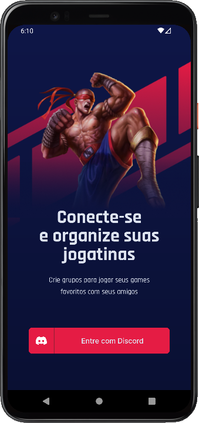

<h1 align="center">GamePlay
	<br/>
	
	<br/>
</h1>


[](https://github.com/LeoMSSilva)
[](https://github.com/LeoMSSilva)
[](#)
[](https://github.com/LeoMSSilva/gamePlay/stargazers)
[](https://github.com/LeoMSSilva/gamePlay/network/members)
[](https://github.com/LeoMSSilva/gamePlay/graphs/contributors)

---

# :pushpin: Table of Contents

- :house: [About](#house-about)
- :dart: [Installation](#dart-installation)
  - :gear: [Install dependencies](#hammer_and_wrench-install-dependencies)
  - :rocket: [Getting started](#rocket-getting-started)
- :computer: [Techs](#computer-techs)
- :bust_in_silhouette: [Author](#bust_in_silhouette-author)
- :handshake: [Contributing](#handshake-contributing)
- :scroll: [License](#scroll-license)

---

# :house: About

This project was developed in **typescript** language, using **react native** and **expo** frameworks.

I used **javascript** and **json** languages ​​as secondary languages, just for the configuration files.

I used the **commitlint**, **@commitlint/config-conventional**, **commitizen** and **cz-conventional-changelog** libraries to keep the patterns in the commits, the **prettier**, **@trivago/prettier-plugin-sort-imports** and **eslint** (*config*: **prettier**, **@react-native-community**; *plugins*: **prettier**, **@typescript-eslint**, **@react-native-community**; *parser*: **@typescript-eslint**) libraries to maintain formatting standards, also helping to remove errors in the code, and the **husky**, **lint-staged** libraries to automate tasks before committing new code to ensure that the code is formatted and without errors.

I used the **babel plugin module resolver** library to define relative paths and the **dotenv** and **babel plugin inline dotenv** libraries to set environment variables

To carry out the user authentication process, the **expo auth session** library was used, and to generate a unique id, the **react native uuid** library was used.

To make all queries to external APIs through requests, the **axios** library was used.

To save the data locally, so that you can close and open the application without loss, the **async storage** library was used.

I used the **react native svg** and **react native svg transformer** libraries to work with svg images.

I used the **expo linear gradient** library to customize background with gradient, the **expo status bar** library to customize status bar, for custom fonts I used the **expo font** library with the fonts ***inter*** and ***rajdhani***, and ensured the preservation of the ios layout through the **react native iphone x helper** library.

I used the **react native gesture handler** and the **react native reanimated** libraries to work with gestures in the app.

The **react navigator stack** library to build navigation between application screens.

This project is about a personalized agenda so that you can organize yourself and not forget your schedules.

It has game creation and filtering options.

You can also create groups with your friends to play together.

You can access the project through the qr code published at **[expo](https://expo.dev/@leomssilva/gamePlay)**.

---

# :dart: Installation

**First you need to install:**

- [Node.js](https://pt-br.nodejs.org/) (required)
- [Yarn](https://yarnpkg.com/) (optional)
- [Expo](https://expo.io/) (required)

  **Then in order, clone the project.**

By HTTPS, running this command:

```bash
  git clone https://github.com/LeoMSSilva/gamePlay.git
```

Or by ssh, running this command:

```bash
  git clone git@github.com:LeoMSSilva/gamePlay.git
```

SSH is a secure protocol, but you need to register a key ssh in your github before.

## :hammer_and_wrench: Install dependencies

```bash
  yarn
```

or

```bash
  yarn install
```

## :rocket: Getting Started

```bash
  yarn start
```

---

# :computer: Techs

- Async storage
- Axios
- Babel plugin module resolver
- Commitlint 
  - @commitlint/config-conventional
- Commitizen 
  - cz-conventional-changelog
- Dotenv and babel plugin inline dotenv
- Eslint
  - config: 
    - prettier
    - @react-native-community
  - plugins: 
    - prettier
    - @typescript-eslint
    - @react-native-community
  - parser: 
    - @typescript-eslint
- Expo
- Expo auth session
- Expo font 
  - Inter
  - Rajdhani
- Expo linear gradient
- Expo status bar
- Javascript
- Husky
- Lint-staged
- Prettier 
  - @trivago/prettier-plugin-sort-imports
- React
- React native
- React native gesture handler
- React native iphone x helper
- React native reanimated
- React native svg
- React native svg transformer
- React native uuid
- React navigation
- Typescript

---

# :bust_in_silhouette: Author

**LeoMSSilva**

- Github: [@LeoMSSilva](https://github.com/LeoMSSilva)
- LinkedIn: [@LeoMSSilva](https://linkedin.com/in/LeoMSSilva)

---

# :handshake: Contributing

Contributions, issues and feature requests are welcome! Feel free to **file a new issue** on the [gamePlay](https://github.com/LeoMSSilva/gamePlay/issues) repository. If you already found a solution to your problem, **I would love to review your pull request**!

---

# :scroll: License

Copyright :copyright: 2022 [LeoMSSilva](https://github.com/LeoMSSilva).
<br/>
This project is [MIT](https://github.com/LeoMSSilva/gamePlay/blob/main/LICENSE) licensed.

---